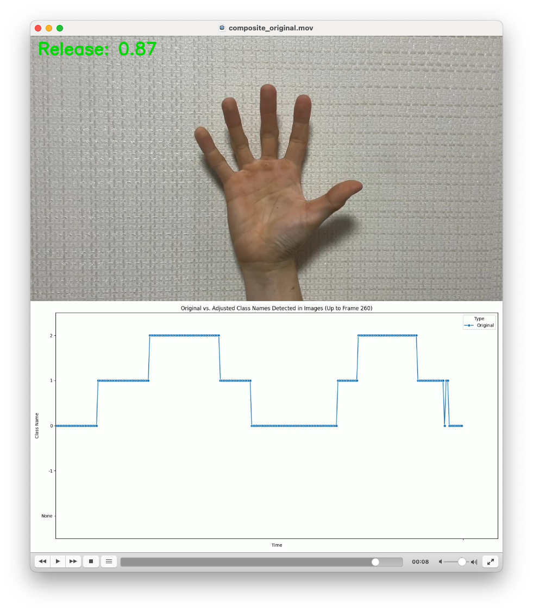

# Enhancing Frame-Level Stability in YOLO Image Classification with Simple Moving Average for Hand Gesture Recognition

- For the Korean version of the project summary, see here: (TO BE UPDATED)
- Also see:  [Google Slide Presentation (in Korean)](https://docs.google.com/presentation/d/15e_nBQsfDuISFk8tTSFhq8_cxQKo__2_M940YDAwWbA/edit#slide=id.p)

## Overview
This repository contains the implementation of a hand gesture classification system using YOLO v8 Nano. The project aims to enhance the frame-level stability in image classification by applying a simple moving average (SMA) technique to smooth out oscillations in the classification of hand gestures.

## Features
- **Object Classification**: Utilizes YOLO v8 Nano for efficient and fast hand gesture recognition.
- **Oscillation Reduction**: Implements SMA to reduce frame-to-frame classification fluctuations.
- **Three-Class System**: Classifies hand gestures into 'open hand', 'folding hand', and 'folded hand'.

## Program Demo
[](assets/composite_original.mp4)


## Requirements
- Python 3.9
- Dependencies listed in `requirements.txt`

## Installation
1. Clone the repository:
   ```
   git clone https://github.com/dchlseo/yolo-moving-average.git
   ```
2. Install dependencies:
   ```
   pip install -r requirements.txt
   ```

## Usage
To run the gesture classification:
```
(TO BE UPDATED)
```


This README provides a concise yet comprehensive guide to setting up and using the project. Modify it as necessary to fit the specific details and requirements of your implementation.
